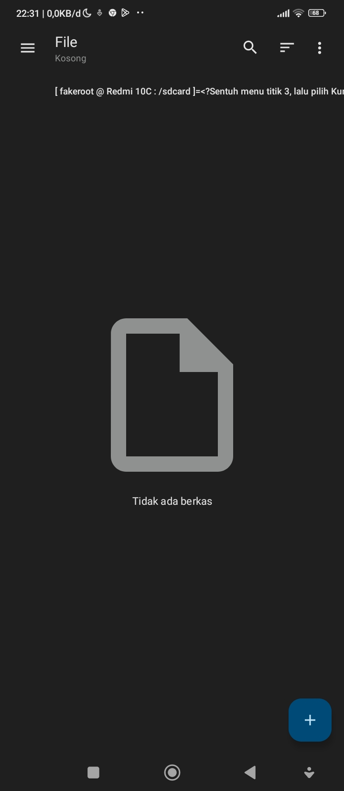
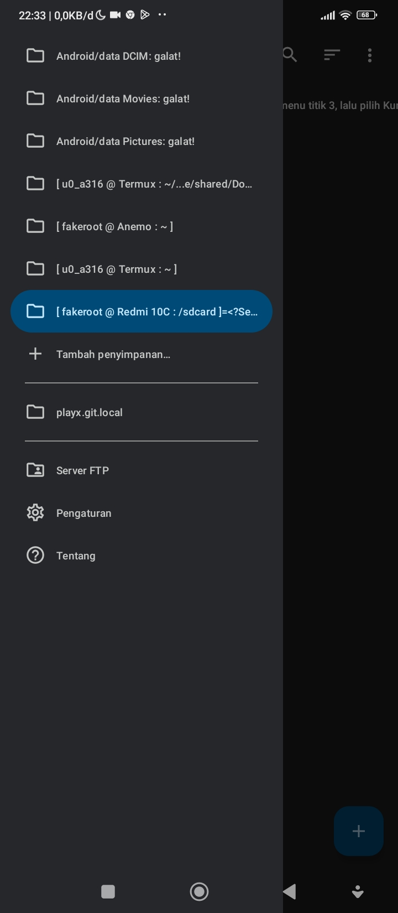

# bookmarks-material-files

Bookmark Material files :

please translate to your original language, this text is still in Indonesian 

Tampilan Beranda 



Tampilan menu



## A. Penyimpanan 

° Root ```/```

° Penyimpanan bersama internal ```/storage/emulated/0```

'*' Kartu SD ```content://com.android.externalstorage.documents/tree/5EEC-1F12 Kartu SD```

'*' Zugate ``` SESUAIKAN ```

• Android/data DCIM: galat! ```content://com.android.externalstorage.documents/tree/primary%3ADCIM``` 

• Android/data Movies: galat! ```content://com.android.externalstorage.documents/tree/primary%3AMovies```

• Android/data Pictures: galat! ```content://com.android.externalstorage.documents/tree/primary%3APictures```

• [u0_a316 @ Termux : ~/...e/shared/Downloads: ] ```content://com.termux.documents/tree/%2Fdata%2Fdata%2Fcom.termux%2Ffiles%2Fhome%2Fstorage%2Fdownloads```

• [ fakeroot @ Anemo : ~ ] ```content://exe.bbllw8.anemo.documents/tree/root```

• [ u0_a316 @ Termux : ~ ] ```content://com.termux.documents/tree/%2Fdata%2Fdata%2Fcom.termux%2Ffiles%2Fhome```

• [ fakeroot @ Redmi 10C : /sdcard ]=<?Sentuh menu titik 3, lalu pilih Kunjungi, ketik " /sdcard"  kemudian Oke> ```content://com.android.externalstorage.documents/tree/primary%3ADownload%2F%E3%85%A4%E3%85%A4%2F%E3%85%A4%2F%E3%85%A4%2F%E3%85%A4%2F%E3%85%A4```

## B. Folder Standar 

MATI


## C. Folder markah

SESUAIKAN 


## D.  Folder Semula

ERROR [ fakeroot @ Redmi 10C : /sdcard ]=<?Sentuh menu titik 3, lalu pilih Kunjungi, ketik " /sdcard"  kemudian Oke>


### indikator :

° adalah tersembunyi

'•' adalah telah di-mount 

'*' adalah belum di-mount

MATI adalah tidak pernah diaplikasikan

SESUAIKAN adalah jarang diaplikasikan

ERROR adalah fitur kunci buatan


### formasi :

$1 adalah nama

$2 adalah jalur/uri penyimpanan 

